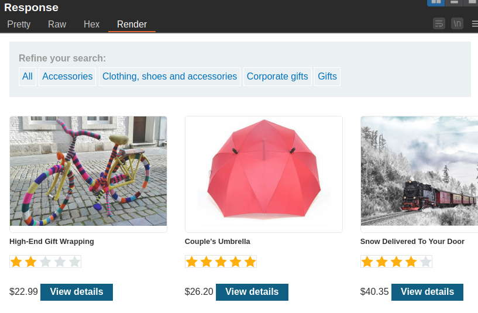

What follows is solution to various sql injection labs. The labs are from [Portswigger](https://portswigger.net) and [PentesterLab](https://pentesterlab.com).

## Portswigger Labs

### [Lab 1: SQL injection vulnerability in WHERE clause allowing retrieval of hidden data](https://portswigger.net/web-security/sql-injection/lab-retrieve-hidden-data)

### Task

***This lab contains a SQL injection vulnerability in the product category filter. When the user selects a category, the application carries out a SQL query like the following:***

```sql
SELECT * FROM products WHERE category = 'Gifts' AND released = 1
```

***To solve the lab, perform a SQL injection attack that causes the application to display one or more unreleased products.***

### Solution

Initial request to the product category endpoint:

```http
GET /filter?category=Gifts HTTP/2
Host: 0af2009f0450fade80d6941f008f0019.web-security-academy.net
Cookie: session=hGmkEl6IBiujl1QH2Hrwm8fpzk3qm5uB
Sec-Ch-Ua: "Google Chrome";v="117", "Not;A=Brand";v="8", "Chromium";v="117"
Sec-Ch-Ua-Mobile: ?0
Sec-Ch-Ua-Platform: "Linux"
Upgrade-Insecure-Requests: 1
User-Agent: Mozilla/5.0 (X11; Linux x86_64) AppleWebKit/537.36 (KHTML, like Gecko) Chrome/117.0.0.0 Safari/537.36
Accept: text/html,application/xhtml+xml,application/xml;q=0.9,image/avif,image/webp,image/apng,*/*;q=0.8,application/signed-exchange;v=b3;q=0.7
Sec-Fetch-Site: same-origin
Sec-Fetch-Mode: navigate
Sec-Fetch-User: ?1
Sec-Fetch-Dest: document
Referer: https://0af2009f0450fade80d6941f008f0019.web-security-academy.net/
Accept-Encoding: gzip, deflate
Accept-Language: en-US,en;q=0.9
```

The image below shows the response to the above request:


